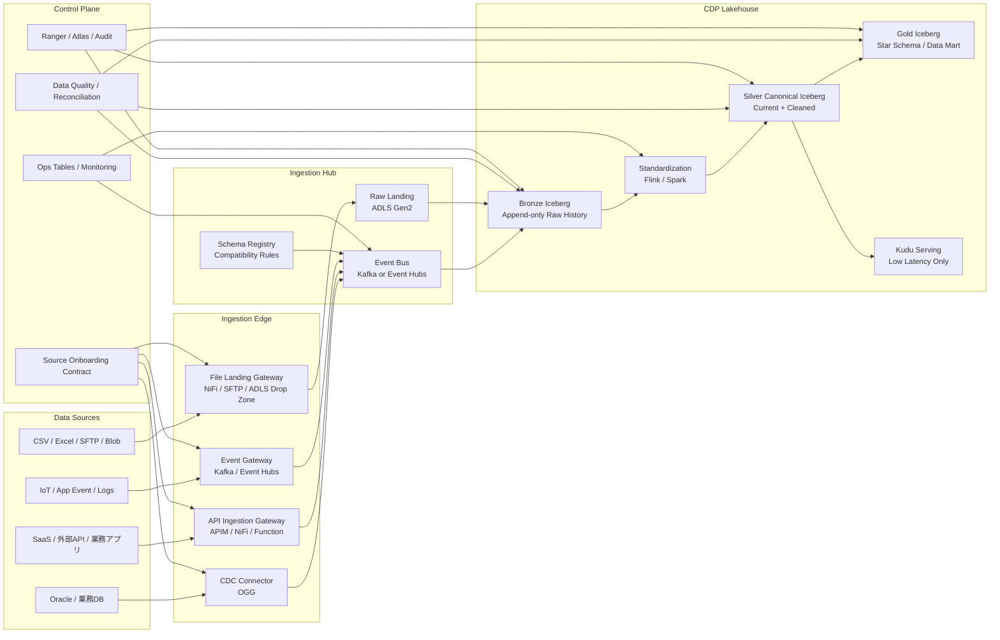

# TOYOTEC 新アーキテクチャ改善案

## 1. 結論サマリー

本改善案では、前回案の `OGG -> Kafka -> Flink -> Bronze/Silver/Gold` を単純に拡張するのではなく、**「Oracle CDC基盤」から「CDP連携プラットフォーム」へ設計を引き上げる**方針を推奨します。

前回案の良い点である CDC、Bronze履歴、Silver完全性チェック、Gold Star Schema は残します。ただし、以下は変えます。

| 観点 | 前回案寄り | 改善案 |
|---|---|---|
| 基盤の主目的 | Oracle CDCの移行・再構築 | 今後の複数データソースを受け入れるCDP連携基盤 |
| 入口 | OGG/Kafka中心 | CDC / API / File / Event の4入口を標準化 |
| Silver | Kudu中心になりがち | Iceberg中心。Kuduは低遅延Serving用途に限定 |
| 外部連携 | ソースごとに個別設計 | Source Onboarding Contractで標準化 |
| 運用 | パイプライン単位の監視 | ソース登録、Schema、DQ、権限、SLAをControl Planeで管理 |
| MVP | 代表OracleテーブルのCDC検証 | 4入口の標準を定義し、実装はPhase 1/2で段階検証 |

全SilverをKudu前提にすると、テーブル増加時の物理設計、再処理、監視、障害対応の運用負荷が高くなります。標準Silverは Iceberg、Kuduは要件が明確なServing用途に限定する方が、商用運用と拡張性のバランスが良いです。

## 2. 目的・前提・MVP

**目的**

- Oracle CDC移行だけでなく、今後増える外部データソースをCDPへ軽く連携できる基盤にする。
- データソース追加時の作業を「個別設計・個別実装」から「標準パターン選択・設定駆動」に寄せる。
- Cloudera + Azure 前提で、運用、監査、再処理、権限、データ品質を最初から設計に含める。

**前提**

- TOYOTEC環境は Cloudera on Azure を想定する。
- ADLS Gen2 を永続ストレージの中心に置く。
- Iceberg を Bronze / Silver / Gold の標準テーブル形式候補にする。
- Oracle CDC は OGG を主候補にするが、OGG設定権限、SCN、before image、PK更新、TRUNCATE、DDL変更の扱いは未確認事項として残す。
- Cloudera DataFlow / NiFi、KafkaまたはEvent Hubs、Flink、CDE Spark/Airflow、Ranger/Atlas系の利用可否は契約・構成確認が必要。
- Cloudera on Azureでは、ADLS Gen2、Entra ID、Key Vault、VNet/Private Endpoint、Ranger/Atlasの責任分界を最初に確定する。
- 外部連携入口はインターネット公開を前提にせず、閉域接続、IP制限、認証方式、証跡取得、秘密情報の保管場所を Source Onboarding Contract の必須項目に含める。

**MVP範囲**

- 4入口（CDC / API / File / Event）の設計標準を定義する。
- 実装は段階化し、Phase 1で Oracle CDC と File Landing、Phase 2で API と Event を通す。
- Source Onboarding Contract の雛形を作る。
- Bronze標準メタデータ、Schema管理、DQ、監視、権限申請の最小セットを作る。
- Silverは Iceberg 中心で作り、Kuduは代表1〜2テーブルの低遅延Serving検証に限定する。
- Goldは旧帳票完全再現ではなく、代表業務マートを1〜2個作る。

**MVPでやらないこと**

- 全242テーブルの一括展開。
- 全SilverのKudu化。
- 完全セルフサービス化。
- 旧114帳票の完全再現。
- リアルタイム要件が未確定なテーブルの秒単位処理。
- DR/BCPの完全実装。ただし、方針と最低ラインは決める。

## 3. 推奨アーキテクチャ



### 設計の要点

1. **入口は4種類に標準化する**
   - CDC入口: Oracleなど、更新履歴・削除・順序性が重要なDB。
   - API入口: SaaS、外部システム、業務アプリ。
   - File入口: CSV、Excel、SFTP、手動配置、部門データ。
   - Event入口: IoT、アプリイベント、ログ、高頻度イベント。

2. **CDP内部の契約は統一する**
   入口は複数あってよいですが、Bronze以降のメタデータ、命名、DQ、権限、監視、再処理の考え方は統一します。これをしないと、データソースが増えるたびに別基盤が増えます。

3. **Bronzeは原本性を優先する**
   Bronzeでは業務変換をしません。受け取った事実、受信時刻、source_id、schema_version、ingestion_id、SCN/offset/watermark、file_nameなどを残し、障害調査と再処理の根拠にします。

4. **SilverはIcebergを標準にする**
   Silverは「CDP内の標準化済みCanonical層」として Iceberg を第一候補にします。Kuduは標準Silverではなく、低遅延鮮度、主キーlookup、高頻度upsert、小粒度更新、高同時参照など、Iceberg/Impala/CDWだけでは要件を満たしにくいServing用途に限定します。採用時は対象テーブル、主キー、partition/tablet設計、SLA、再処理方法、運用責任をADRで明文化します。

5. **Control Planeをアーキテクチャに含める**
   連携を軽くする本体は、パイプライン処理よりも Control Plane です。Source Onboarding Contract、Schema、DQ、権限、SLA、運用台帳、監査ログがないと、追加連携は毎回重くなります。

## 4. Source Onboarding Contract

データソース追加時は、まずこの定義を作ります。これを元に、Bronze DDL、取り込み設定、DQ、監視、権限申請、運用台帳を半自動生成する想定です。

```yaml
source_id: toyotec_salesforce_customer
source_name: Salesforce Customer
source_type: api
owner_department: sales
business_owner: sales-data-owner@example.com
technical_owner: data-platform@example.com

ingestion:
  mode: incremental
  pattern: api_pull
  schedule: hourly
  expected_latency: 60m
  retry_policy: standard
  watermark_column: updated_at
  primary_key:
    - customer_id

schema:
  format: json
  registry_subject: toyotec.salesforce.customer.v1
  compatibility: backward
  breaking_change_policy: approval_required

targets:
  bronze_table: bronze.toyotec_salesforce_customer_raw
  silver_table: silver.customer
  gold_domain: customer_analytics

metadata:
  sensitivity: confidential
  pii_fields:
    - customer_name
    - phone_number
    - email
  retention:
    bronze: 10y
    silver: 5y
  lineage_required: true

dq_checks:
  - type: not_null
    columns: [customer_id]
  - type: unique
    columns: [customer_id]
  - type: freshness
    threshold_minutes: 90

operations:
  support_contact: sales-system@example.com
  source_sla: business_hours
  replay_supported: true
  backfill_method: api_export
```

この契約を作る狙いは、データソース追加を「個別判断で都度設計する」状態から外すことです。完璧な自動化はMVPでは不要ですが、契約ファイルがない連携は原則CDPに入れない、という運用ルールを置くと後続の品質・権限・監査が安定します。

## 5. 連携障壁を下げる具体策

| 改善策 | 内容 | 効果 |
|---|---|---|
| 入口4パターン化 | CDC / API / File / Event を標準パターン化 | 外部システムごとにゼロから方式検討しなくてよい |
| Source Onboarding Contract | source_id、owner、SLA、schema、DQ、権限、再処理を定義化 | 連携前の確認事項が揃い、属人判断が減る |
| Managed File Landing | 小規模・部門データはADLS/SFTP配置で受けられるようにする | APIやKafkaを持てない相手でも連携可能 |
| API Ingestion Gateway | 外部システム向けにpush/pull API入口を用意 | 「Kafkaに投げてください」より導入障壁が低い |
| Schema Registry | schema_versionと互換性ルールを管理 | 下流破壊を事前検知できる |
| Bronze標準メタデータ | source_id、ingestion_id、ingested_at、offset/watermarkを必須化 | 障害調査、再処理、差分確認ができる |
| DQテンプレート | not_null、unique、freshness、件数差分を標準化 | 追加連携時の最低品質を保てる |
| 権限テンプレート | Ranger role matrix、PII分類、masking方針を標準化 | セキュリティレビューのたびに止まらない |
| Onboarding台帳 | owner、連携方式、頻度、SLA、連絡先、運用状態を管理 | 保守・障害対応・棚卸しができる |

特に重要なのは、**外部システムに一律Kafkaを要求しないこと**です。KafkaやEvent Hubsは内部標準としては良いですが、相手システムにとっては負担が大きい場合があります。CDP側が複数入口を持ち、CDP内部で標準形式に寄せる方が現実的です。

Kafka/Event Hubsは代替可能な単純部品として扱いません。Clouderaネイティブ運用、Schema Registry、既存Kafka資産、低遅延ストリーム処理を重視する場合はKafkaを優先し、Azureマネージド運用、外部Azureサービス連携、運用負荷低減を重視する場合はEvent Hubsを候補にします。MVPではどちらか一方を標準バスとして固定し、もう一方は接続パターンとして扱います。

## 6. レイヤ別の推奨構成

| レイヤ | 推奨 | 注意点 |
|---|---|---|
| External Edge | API Management、NiFi/DataFlow、SFTP/ADLS Drop Zone、Kafka/Event Hubs | 外部公開APIは認証、IP制限、rate limit、監査ログを必須にする |
| Ingestion Hub | KafkaまたはEvent Hubs、Schema Registry | Kafka/Event Hubsのどちらを標準にするかはネットワーク、運用、Cloudera構成で決める |
| Raw/Bronze | ADLS Gen2 + Iceberg append-only | 業務変換を入れない。原本性、再処理、履歴を優先 |
| Standardization | Flink、Spark、CDE jobs | CDC正規化はFlink、定期変換・再処理はSpark/CDEに寄せる |
| Silver | Iceberg Canonical tables | Kuduを標準Silverにしない。低遅延要件がある場合だけ併設 |
| Serving | Kudu、Impala/CDW、API serving | Kuduは要件駆動。BI主参照はGoldを基本にする |
| Gold | Iceberg Star Schema / Data Mart | 旧SQL再現ではなく、業務指標とディメンションを契約化する |
| Governance | Ranger、Atlas/Data Catalog、監査ログ | PII分類と権限設計をオンボーディング時に必須化 |
| Operations | ops tables、Azure Monitor/Log Analytics、Cloudera監視 | pipeline単位でなく source_id 単位で状態を見られるようにする |

## 7. セキュリティ・ネットワーク最小ベースライン

外部連携の障壁を下げることと、入口を緩くすることは別です。入口を増やすほど、認証、秘密管理、監査、PII分類を標準化しないと後で止まります。

| 領域 | 最小要件 |
|---|---|
| Network | 原則は閉域接続、Private Endpoint、IP制限を優先。外部公開APIは例外扱いにし、WAF/rate limit/監査ログを必須にする |
| Identity | Entra ID、サービスプリンシパル、Managed Identity、Ranger role の責任分界を決める |
| Secrets | DB password、API key、token、証明書はKey Vault等で管理し、NiFi/Flink/Sparkの設定ファイルに直書きしない |
| Storage Access | ADLS Gen2のcontainer/path権限とRanger権限を対応付ける |
| PII | Source Onboarding Contractで機密度、PII候補、masking要否、参照可能roleを必須入力にする |
| Audit | API受信、file配置、schema変更、権限変更、再処理、手動補正は監査ログに残す |

## 8. MVPフェーズ分割と完了条件

4入口は設計標準としてMVP内で定義しますが、初回実装で同時に全部を作り切るとCDC品質・セキュリティ・運用設計が薄くなります。実装は段階化します。

| Phase | 対象 | 完了条件 |
|---|---|---|
| Phase 1 | Oracle CDC + File Landing | Bronze/Silver、DQ、Recon、監視、権限、再処理が source_id 単位で通る |
| Phase 2 | API + Event | Phase 1と同じ Source Onboarding Contract と Ops台帳で受けられる |
| Phase 3 | 代表Gold + Serving | 代表業務マート、Kudu候補1〜2テーブル、Gold検収条件が揃う |

Phase 1の完了条件は、単にデータが入ることではありません。`契約ファイル -> 入口設定 -> Bronze -> Silver -> DQ/Recon -> 監視 -> 権限 -> 再処理` まで一通り動くことです。

## 9. Kudu採用ADRの判断基準

Kuduは採用してよい技術ですが、標準Silverの前提にしない方がよいです。採用判断は以下で切ります。

| 判断軸 | Kuduを検討する条件 | Iceberg中心でよい条件 |
|---|---|---|
| 鮮度 | 秒〜サブ分単位の反映が必要 | 数分〜数十分以上を許容 |
| クエリ | 主キーlookup、限定範囲検索、高同時参照が中心 | BI集計、履歴分析、バッチ参照が中心 |
| 更新 | 高頻度upsert、小粒度更新が多い | append/merge中心で再処理を重視 |
| 運用 | tablet設計、skew監視、rebalance、復旧責任を持てる | Lakehouse標準運用へ寄せたい |
| 再処理 | Kudu再構築・再同期手順を定義できる | Iceberg snapshot/再計算で復旧したい |

Kuduを採用する場合は、対象テーブル、主キー、partition/tablet設計、SLA、再処理方法、障害時の復旧手順、運用責任をADRに書きます。

## 10. CDC / DQ / Reconciliation 検収条件

CDC系DQは、`not_null`、`unique`、`freshness` だけでは不十分です。Bronze、Silver、Goldで検収の意味を分けます。

| レイヤ | 検収観点 |
|---|---|
| Bronze | event受信件数、SCN/offset連続性、重複event、schema_version、ingestion_id、受信遅延、再取込可能性 |
| Silver | PK単位の最新状態一致、delete反映、PK変更、TRUNCATE、遅延到着、再実行時の冪等性、Oracle断面との件数/ checksum比較 |
| Gold | 指標定義、集計粒度、旧帳票サンプル比較、業務許容差、リカバリ時の再計算手順 |

OGG readiness gate では、SCN、before image、PK更新、delete、truncate、DDL変更、Kafka offsetとの対応、販社別の欠損検知を代表テーブルで確認します。

## 11. Source Onboardingの運用フローとRACI

| Step | 内容 | 主担当 |
|---|---|---|
| 1. 申請 | Source Onboarding Contractを作成 | Data Owner |
| 2. 技術確認 | 接続方式、ネットワーク、認証、再処理可否を確認 | Platform Owner |
| 3. セキュリティ確認 | PII、機密度、権限、秘密管理、監査要件を確認 | Security Owner |
| 4. 生成 | Bronze DDL、DQテンプレート、監視設定、Runbook初版を生成 | Data Platform Team |
| 5. 検証 | 代表データでDQ、Recon、再処理、権限を確認 | Data Platform Team / Data Owner |
| 6. 本番化 | 承認後に本番連携へ昇格 | Data Owner / Platform Owner |

Control Planeでは、最低限 `ops.source_registry`、`ops.schema_registry_link`、`ops.ingestion_run`、`ops.dq_result`、`ops.access_request`、`ops.lineage_status`、`ops.incident_log` を source_id 単位で管理します。

## 12. 優先順位

| 優先 | 改善項目 | 完了条件 |
|---|---|---|
| P0 | 入口4パターンの標準化 | CDC/API/File/Event の方式、責任境界、最小テンプレートが決まっている |
| P0 | Source Onboarding Contract | 1ソース1定義で、owner、schema、SLA、DQ、権限、再処理が表現できる |
| P0 | Silver=Iceberg標準、Kudu=Serving限定のADR | Kudu採用条件と非採用条件が明文化され、SOWの前提に入っている |
| P0 | OGG readiness gate | SCN、before image、PK更新、delete、truncate、DDL変更の検収条件がある |
| P0 | セキュリティ最小ベースライン | PII分類、Ranger role matrix、Key Vault、監査ログ保持が最低限決まっている |
| P1 | Schema Registry / 互換性ルール | 破壊的変更時の承認、通知、下流影響確認フローがある |
| P1 | DQ / Reconciliation標準 | Bronze受信、Silver反映、Gold指標の最低チェックがテンプレート化されている |
| P1 | Ops table設計 | source_id単位で取り込み状態、遅延、失敗、再実行、DQ結果を追える |
| P1 | Gold contract | 旧帳票再現ではなく、業務マートと指標定義の検収条件がある |
| P2 | セルフサービス化 | 申請フォーム、テンプレート、生成スクリプト、レビュー手順を段階的に整える |

## 13. リスク

| リスク | 重大度 | コメント | 対応 |
|---|---|---|---|
| 入口だけ増えて標準化されない | 高 | NiFi、API、File、Kafkaがバラバラに増えると、基盤の保守性が落ちる | Source Onboarding Contractを必須化し、Bronze以降の契約を統一する |
| Kuduが標準Silver化する | 高 | テーブル増加時に運用・再処理・物理設計が重くなる | Kuduは低遅延Servingに限定し、ADRで条件を固定する |
| OGG品質が未確認 | 高 | CDCの欠損や順序崩れは後から検出しづらい | readiness gateを作り、代表テーブルで必ず検証する |
| セキュリティが後付けになる | 高 | 外部連携が増えるほどPII、秘密情報、監査の負債が増える | source登録時に機密度、PII、権限、秘密管理を必須入力にする |
| NiFiに業務ロジックが散る | 中 | 便利な分、複雑な変換を入れやすい | NiFiは搬送、軽バリデーション、メタデータ付与までに制限する |
| Gold期待値が曖昧 | 中 | 旧帳票完全一致を期待されるとStar Schema方針と衝突する | Gold contractで指標、粒度、比較範囲、非互換を先に握る |
| 運用責任境界が曖昧 | 中 | Azure側、CDP側、外部システム側の障害切り分けが揉める | RACIと障害時RunbookをMVPで作る |

## 14. 次アクション

1. **アーキテクチャ方針を1枚に固定する**
   `CDP連携プラットフォーム`、`入口4パターン`、`Iceberg標準Silver`、`Kudu限定Serving` をADRとして残します。

2. **MVPをPhase 1/2に分ける**
   Phase 1は Oracle CDC と File Landing を優先し、Bronze、Silver、DQ、Recon、監視、権限、再処理まで通します。Phase 2で API と Event を追加します。

3. **Kudu採用条件をSOW前に決める**
   鮮度SLAだけでなく、主キーlookup、高頻度upsert、小粒度更新、高同時参照、対象テーブル、運用責任が決まらない限り、Kuduを標準Silverにしない方がよいです。

4. **OGG readiness gateを作る**
   include tokens、before image、PK更新、delete、truncate、DDL変更、SCNとKafka offsetの対応を代表テーブルで確認します。

5. **Control Planeの最小実装を入れる**
   最初から `ops.source_registry`、`ops.schema_registry_link`、`ops.ingestion_run`、`ops.dq_result`、`ops.access_request`、`ops.lineage_status`、`ops.incident_log` を用意します。

6. **顧客向け説明では「連携を軽くする」価値を前面に出す**
   技術的にはLakehouse再構築ですが、顧客価値としては「今後データソース追加時のリードタイムを短縮し、品質・権限・監査を標準化する」ことです。

## 15. 確認・未確認

**確認したこと**

- 前回レビュー成果物と対象input配下のファイル一覧を確認した。
- AI Data Platform / Integration観点で独立検討を行い、最終案に統合した。
- AI Deliverable Quality Reviewerによる独立レビューを実施し、MVP分割、Kafka/Event Hubs判断、Kudu採用条件、DQ/Recon、Control Plane、セキュリティ観点を反映した。
- Cloudera DataFlow、CDP Public Cloud、Azure Event Hubs、Azure Data Lake Storage Gen2 の公式URLは存在確認した。

**未確認のこと**

- TOYOTEC環境で利用できるClouderaサービス、ライセンス、バージョン。
- Azureネットワーク、閉域接続、Private Endpoint、Entra ID、Key Vault、ADLS権限の実構成。
- OGGの実設定権限、SCN、before image、PK更新、TRUNCATE、DDL変更の実出力。
- Kafka/Event Hubsどちらを標準バスにできるか。
- Ranger/Atlas/Data Catalog、CDE/Airflow、Schema Registryの利用可否。

## 補足

Cloudera/Azureの各サービス可用性、契約ライセンス、ネットワーク構成、OGG実設定は未確認です。以下の公式ドキュメントURLは存在確認済みですが、導入可否はTOYOTEC環境で別途確認が必要です。

- [Cloudera DataFlow documentation](https://docs.cloudera.com/dataflow/cloud/index.html)
- [Cloudera CDP Public Cloud documentation](https://docs.cloudera.com/cdp-public-cloud/cloud/index.html)
- [Azure Event Hubs documentation](https://learn.microsoft.com/en-us/azure/event-hubs/event-hubs-about)
- [Azure Data Lake Storage Gen2 documentation](https://learn.microsoft.com/en-us/azure/storage/blobs/data-lake-storage-introduction)
